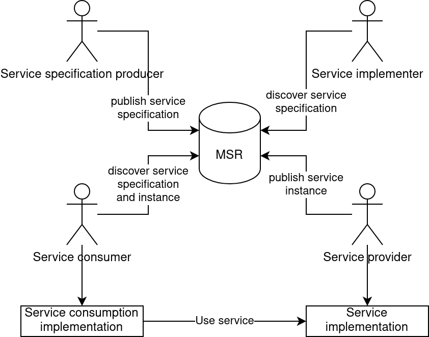
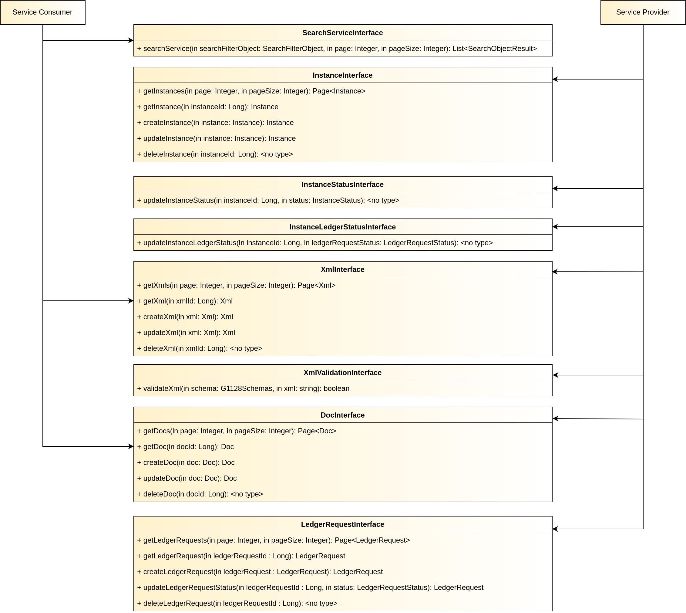
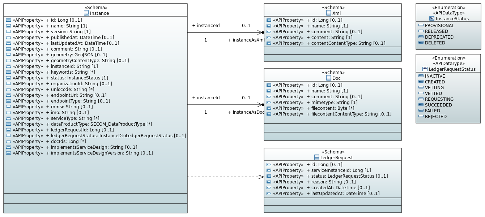

---
titlepage: true
toc: true
toc-own-page: true
title: "Service specification for the MCP Service Registry (MSR)"
author: [MCP Consortium]
date: "2022-06-21"
keywords: [maritime, technical, service, registry, MCP, MSR]
logo: "materials/mcplogo.png"
titlepage-text-color: "476E7D"
footer-center: "G-1128 MSR Service Specification"
code-block-font-size: \footnotesize
listings-disable-line-numbers: true
...

# Introduction

In IMO resolution MSC.467(101) “Guidance on the Definition and Harmonization of
the Format and Structure of Maritime Services in the Context of e-Navigation”
[1], IMO defines Maritime Services and Technical Services in the context of
e-Navigation. In this resolution, the Maritime Services are on the highest 
level, describing a service in an entirely non-technical manner. One or more
Technical Services are associated with a Maritime Service, and these Technical
Services are the ones defining the actual information exchange needed to take
place in order to carry our a Maritime Service.

The Maritime Service Registry [2], or MSR for short, assumes the role of a
general  registry for Technical Services. It provides a reference point to the
most relevant information and the respective end-points of the registered  
services and thus to improve the accessibility of available services in the  
maritime domain.

The Technical Services in the resolution are also defined on three levels
following the same structure as in IALA G-1128 [3] guideline, where MSR 
supervises all service providers to describe their service in the format of 
G-1128.

## Purpose
<!--
    This template shall support the service architects in creating a description
    of the services (put down in writing) at a high level of abstraction,
    following the guidelines given in [1].  The template provides for each 
    section descriptive instructions for the intended content.  Formally, such
    instructions are written in blue italic font – they shall be deleted when 
    writing the actual service specification document.  In addition, some parts
    of this template provide suggested text fragments that may be directly 
    re-used in the service specification document. Such proposed text fragments
    are given below.
    
    The purpose of the service specification document is to write down the 
    results of service identification and service design activities. The aim is
    to document the key aspects of a dedicated service at the logical level:
        * the operational and business context of the service;
          * requirements for the service (e.g. information exchange requirements);
          * involved nodes: which operational components provide/consume the service;
          * operational activities supported by the service;
          * relation of the service to other services:
        * the service description;
          * service interface definitions;
          * service interface operations;
          * service payload definition;
        * service provision and validation aspects.
    
    This service specification document describes just one dedicated service in 
    detail at logical level. In addition, there shall exist a service portfolio
    document, which presents all services of the maritime cloud that are 
    available (or are planned to become available) at a higher level.
    
    The purpose of this service specification document is to provide a holistic
    overview of one service and its building blocks at logical level.  It may be
    complemented by a model based description (e.g. UML model describing the
    service interfaces, operations and data structures).  The service 
    specification document describes a well-defined baseline of the service and
    clearly identifies the service version.  In this way, it supports the 
    configuration management process.
    
    The service specification document provides also the foundation material for
    the future standardisation process.
    
    Note that the service specification is intended to be technology-agnostic.
    The service specification document shall not describe the details of a
    specific service implementation. For that purpose, a service instance 
    description shall be provided, where the realisation of the service with a 
    dedicated technology shall be described.
    
    This section shall be replaced by a suitable description of the purpose. For
    instance:
-->

The MSR is an implementation of service management concept which was given from
the IALA G-1128 guideline. The main tasks of MSR are the registration of 
Technical Services by a service provider and the provision of a discovery 
mechanism for the registered services, so that any service consumer can identify
available services and gain access. 

The MSR registration needs to be able to register all relevant e-Navigation 
services, commercial and non-commercial, authorized and non-authorized, for free
and against payment. The MSR also needs to allow service consumers to discover
available services and enable the use of those services through defined 
end-point locations. It can therefore be seen as a sophisticated yellow pages 
phone book. A registry can be searched using a wide variety of different
criteria including the coverage area of interest.

## Intended readership
<!--
  This service specification template is intended to be read by service 
  architects who shall produce service descriptions.

  This section shall describe the intended readers. e.g.:
-->

This service specification is primarily intended to be read by architects,
system engineers and developers in charge of developing and operating an 
instance of the MSR service.

Furthermore, this service specification is intended to be read by enterprise 
architects, service architects, information architects, system engineers and 
developers in pursuing architecting, design and development activities of 
other related e-Navigation services.

## Inputs from other sources
<!--
  This section lists previous work on the subject covered by this document.

  Special emphasis shall be put on what has been reused from other (already
  finished) projects. 
-->

The service management concept originally given from the IALA G-1128
guideline was given and implemented throughout previous projects such as
EfficienSea2 [4] and Sea Traffic Management.

# Service identification

The purpose of this section is to provide a unique identification of the service
and describe where the service is in terms of the engineering lifecycle.

<!-- Table below shall be completed. -->

<!-- Spacing: |--- | --------- | -->
| Attribute    | Content                                                                                                                                                                                                             |
|--- | --------- |
| Name         | Maritime Service Registry (MSR)                                                                                                                                                                                     |
| ID           | urn:mrn:mcp:service:mcc:mcc:specification:msr                                                                                                                                                                       |
| Version      | 0.0.1                                                                                                                                                                                                               |
| Description  | A service registry acting as a reference point to provide information on the registered services and thus to improve the visibility and accessibility of available information and services in the maritime domain. |
| Keywords     | service, registry, discoverability, specification, G-1128, technical                                                                                                                                                |
| Architect(s) | MCC MSR WG                                                                                                                                                                                                          |
| Status       | Provisional                                                                                                                                                                                                         |

# Operational Context
<!--
    The operational context description shall be based on the description of the
    operational model, consisting of a structure of operational nodes and
    operational activities.  If such an operational model exists, this section
    shall provide references to it.  If no such operational model exists, then 
    its main aspects shall be described in this section.
    
    Optionally, a simple high level use case, described in layman’s terms, could
    be provided as an introduction to this section.
    
    The operational context shall be a description of how the service supports
    interaction among operational nodes. This can be achieved in two different
    levels of granularity:
        1. A description of how the service supports the interaction between 
        operational nodes. This basically consists of an overview about which
        operational nodes shall provide the service and which operational nodes
        will consume the service.
        2. A more detailed description that indicates what operational 
        activities the service supports in a process model.
    
    Moreover, the operational context shall describe any requirement the service
    will fulfil or adhere to.  This refers to functional as well as 
    non-functional requirements at high level (business/regulatory requirements,
    system requirements, user requirements).  Especially, information exchange
    requirements are of much interest since the major objective of services is
    to support interaction between operational nodes.

    The source material for the operational context description should ideally
    be provided by operational users and is normally expressed in dedicated
    requirements documentation. Ensure that the applicable documents are defined
    in the References section.  If no requirements documents are available, then
    the basic requirements for the service shall be defined in the section D 3.1.
    
    Architectural elements applicable for this description are:
        * Service;
        * Nodes;
        * Operational activities;
        * Information exchange requirements.
-->

This section describes the context of the service from an operational 
perspective.

The main purpose of this section is to provide a description on how the MSR 
supports the interaction among the operational nodes. In this case, these are 
the ***service consumers*** and ***service providers*** that use the MSR. The
MSR acts as a trustworthy information provider to the service consumers, from 
which they can acquire a list of services that conform to a set of selection 
criteria. For service providers the MSR facilitates the dissemination of their 
service information and an access point where the relevant information is 
successfully registered. An example of this whole process can be seen in
the @fig:msrcontext.



Another operational node to be taken into account is the MSR itself. More
specifically, multiple MSR instances that may exist independently of each other.
This kind of decentralized scenarios, demonstrate the need for a certain level
of coordination, especially in terms of service discoverability. This can be
provided by a centralized/distributed ledger service, through which all 
interested MSRs can exchange information on their current registrations. The 
specification of this ledger operation however is outside the scope of this 
document. The participation of an MSR is such a scheme and any implementation 
decisions are therefore left to the MSR service developers/providers.

More detailed descriptions on the basic operational aspects can be found below.

#### Service Registration

An MSR instance provider is naturally only accountable towards its own users, as
defined by any Service Level Agreement (SLA) present. Hence, in regard to 
service registration, an MSR instance should be able to work independently.

Many services registered to an MSR might be local, i.e. will only be 
discoverable in that specific MSR instance. Some services however, might be
intended to be globally available, and should therefore be discoverable
across multiple MSR instances. When such a service is registered in an MSR, 
the registration will have to be propagated to the ledger mechanism mentioned
previously. Thus, the MSR instance provider needs to review whether to support
a centralized/distributed ledger operation.

Services registered in an MSR must follow the IALA guideline on e-Navigation
technical services (G-1128). In this guideline services are described on three
levels:

* Service specification
* Service technical design
* Service instance

The service specification is the highest level, giving a high level description
and containing the data model of the service. This data model may be a reference
to an IHO product specification - or it could define a different data model. A
service specification will have one or more associated technical designs. Each
technical design describes how the service can be implemented using a specific
technology.

Although these technologies in principle can be anything (even a phone number),
the MCC promotes the use of web-services and services using the MMS. For each
technical design there will be one or more service instances that provides
information of concrete service providers. The most important information is the
endpoint of the service, but other significant information includes a 
geographical coverage of the service. It is therefore mandated that any MSR 
implementation must support at least the ***Service Instance*** specification
of G-1128. Support in this context refers to the provision of a G-1128 
compliant service instance specification XML schema. References to the other two
G-1128 specifications (i.e. service specification and technical design) should 
also be provided, although it is acceptable that these are hosted by third 
parties.

Optionally, MSR implementations may also support G-1128 non-compliant service
registrations. In those cases, the XML schema of the service instance 
specification can be omitted and only the mandatory fields of a registration
will be required from the service provider.

#### Service Discoverability

Service discoverability is intended to facilitate the dissemination of the 
e-Navigation service information. As such, the employed mechanism should follow
the most widely-used set of standards, which in the maritime domain related 
directly to the IEC 63173-2 ED1 standard [5], more widely known as SECOM. 

SECOM already defines a mechanism for service discovery and this should be 
employed by the MSR. Apart from the requirements set by SECOM however, the
following additional aspects need to be satisfied:

* Only organisations that are registered in a MIR instance (see details on
  “Vetting procedure for organisations joining MCP instances”; Document ID: MCP
  Gen 5) are allowed to submit service descriptions (any level, i.e. service
  specifications, service designs, and service instances) to an MSR. i.e. a
  submitter needs to authenticate itself using MIR.
* MSR needs to be open for queries/searches without authentication.
* Endpoints in Service Instances needs to point to active services that are in
  production (not test services). This is of course only the case if the MSR
  itself is a production environment.
* Requirements on service provider authentication and service consumer
  authentication is entirely up to the service provider.

In terms of the discoverability mechanism, this should be provided using a query
operation. A query is a just character string broken up into terms and 
operators. There are two types of terms: Single Terms and Phrases.

* A Single Term is a single word such as "test" or "hello".
* A Phrase is a group of words surrounded by double quotes such as "keyword1 
keyword 2".

Multiple terms can be combined together with Boolean operators (e.g. AND, OR) to
form a more complex query. A search can be performed either specify a field,
or use the default field. The field names and default field is implementation
specific. An MSR should support searching in any field by typing the field name
followed by a colon ":" and then the appropriate term. An example of a query,
assuming there are two terms included in it is the following:

\vspace*{-0.9cm}
```{.jql caption="MSR query format example"}
instanceId:"usr:mrn:mcp:msr:int:specification:test" AND version=0.0.1
```

If the *instanceId* is the default field, then field indicator is not required:

\vspace*{-0.9cm}
```{.jql caption="MSR query format example with default field"}
"usr:mrn:mcp:msr:int:specification:test" AND version=0.0.1
```

Wildcard searches should also be supported. 

* To perform a single character wildcard search use the "?" symbol.
* To perform a multiple character wildcard search use the "*" symbol.

#### MRN of Service Documents for Identification

At the time of registration of service, a service provider should be exposed to
the MRN scheme [6] for the identification of service documents. G-1128 clearly 
mentions MRN as a unique identifier scheme. A service provider should follow the
MRN scheme of the MCP Identity Service provider (who operates a MIR) that they
belong. There is a possibility of having more than one MRN of a service document
for the identification.

In MSR, the primary identification MRN needs to be aligned with the MCP MRN
scheme, defined in “MCC Identity Management and Security Identity Management” as
follows:

\vspace*{-0.9cm}
```{.markdown caption="MCP MRN Scheme Rules"}
<MCP-MRN> ::= "urn" ":" "mrn" ":" "mcp" ":" <MCP-TYPE> ":" <IPID> ":" <IPSS>
<MCP-TYPE> ::= "device" | "org" | "user" | "vessel" | "service" | "mir" | "msr" | mms" |
<IPID> ::= <CountryCode> | (alphanum) 0*20(alphanum / "-") (alphanum)
<IPSS> ::= pchar *(pchar / "/")
```

For a service document, the MRN system is defined as follows:

\vspace*{-0.9cm}
```{.markdown caption="MSR Service Document MRN-IPSS definition"}
<MSR-IPSS> ::= <ORG> ":" <G1128-TYPE> ":" <SERVICE-NAME>
<ORG> ::= pchar *(pchar / "/")
<G1128-TYPE> ::= "instance" | "specification" | "design"
```

The ```<ORG>``` section represents an organization ID assigned by MIR, 
```<G1128-TYPE>``` represents the type of the documentation, i.e. specification,
design, or instance, and ```<SERVICE-NAME>``` can be any specific string 
representing a unique identifier of a service.

More detailed description of the syntax is given in the referenced document.

Governance of MRN of service documents is a responsibility of an MSR provider, 
as well as the uniqueness of an MRN at the database level.

## Functional and non-functional requirements
<!--
    This section lists all (functional and non-functional) requirements 
    applicable to the service being described. A tabular list of requirements 
    shall be added here.  If external requirements documents are available, 
    then the tables shall refer to these requirements, otherwise the 
    requirements shall be documented here.
    
    The service must be linked to at least one requirement.  At least one of 
    the following tables shall be presented in this section.  The first table 
    lists references to requirements available from external documents.  Make 
    sure you document the sources from where the requirements are coming from. 
    The second table lists new requirements defined for the first time in this 
    service specification document.
-->

### Functional Requirements

The table below lists applicable existing requirements for the MSR service.

<!-- Spacing: | --- | --- | ------ | --- | -->
| Requirement Id | Requirement Name                 | Requirement Text                                | References |
| --- | --- | ------ | --- |
| MSR-FR001      | Service Registration             | Allow the registrations of new service          | MCC MSR WG |
| MSR-FR002      | Service Registration Update      | Allow updates on an existing registrations      | MCC MSR WG  |
| MSR-FR003      | Service Registration Cancelation | Allow the deletion of an existing registrations | MCC MSR WG  |
| MSR-FR004      | Service Discoverability          | Allow services to be discoverable as per SECOM  | MCC MSR WG  |

The following tables define additional requirements for the XYZ service.

<!-- Spacing: | --- | --------- | -->
| Requirement Id   | MSR-FR005                                                                           | 
| --- | --------- |
| Requirement Name | G-1128 Support                                                                      |
| Requirement Text | Support the registration of services using the G-1128 Service Instance XML schemas. |
| Rationale        | G-1128 standardizes the description of e-Navigation service instances               |
|  Author          | GRAD                                                                                |

<!-- Spacing: | --- | --------- | -->
| Requirement Id   | MSR-FR006                                                                    |
| --- | --------- |
| Requirement Name | Service Instance Documentation                                               |
| Requirement Text | Support multiple to documents to be attached to a service registration       |
| Rationale        | Multiple documentation sources are frequently required to describe a service |
|  Author          | GRAD                                                                         |

#### Non-Functional Requirements

The table below lists applicable existing requirements for the MSR service.

<!-- Spacing: | --- | --- | ------ | --- | -->
| Requirement Id | Requirement Name | Requirement Text                                                                                                     | References |
| --- | --- | ------ | --- |
| MSR-NFR001     | Authenticity    | The service consumers must be able to verify the authenticity of the received data.                                   | MCC MSR WG |
| MSR-NFR002     | Integrity       | It must be clear to both service providers and consumers whether changes have been made to the registered services.   | MCC MSR WG |
|  MSR-NFR003    | Availability    | The service must be available at least at a 99% availability rate.                                                    | MCC MSR WG |

The tables below define additional non-functional requirements for the MSR service.

<!-- Spacing: | --- | --------- | -->
| Requirement Id   | MSR-NFR004                                                                                             |
| --- | --------- |
| Requirement Name | Performance                                                                                            |
| Requirement Text | The service must respond to a request in a timely fashion and not allow any HTTP call to timeout.      | 
| Rationale        | Performance, especially in terms of service discoverability is crucial for a smooth service provision. |
|  Author          | GRAD                                                                                                   |

<!-- Spacing: | --- | --------- | -->
| Requirement Id   | MSR-NFR005                                                                                                                                                                       |
| --- | --------- |
| Requirement Name | Modularity                                                                                                                                                                       |
| Requirement Text | The services architecture must be constructed in such a way that individual functionality can be extended, modified or deleted, without changing the basic service architecture. |
| Rationale        | The MSR should be easily upgradable to ensure future operations.                                                                                                                 |
|  Author          | GRAD                                                                                                                                                                             |

## Other constraints

Inter-compatibility with the other MCP components, namely the MCP Identity
Registry (MIR) and the MCP Messaging Service (MMS) should be ensured. In
regard to different versions, the MSR should make clear which MCP version it
supports and if more than one.

### Relevant industrial standards
<!--
    List in this section the relevant industrial standards (if any) for the
    exchange of this type of data and or this type of service.  These may
    include, for example, OGC, WFS, WMS, etc.
-->

Apart from SECOM, there are no other relevant industrial standards found.

### Operational nodes
<!--
    If an operational model exists in external documents, then this section just
    shows the Service to Nodes mapping by providing three tables, as described
    below.

    If no external operational model exists, then the relevant operational nodes
    and their context shall be briefly described here before listing them in the
    tables of service providers and consumers.
-->

The following tables describe the operational nodes of the service.

#### Operational nodes providing the MSR service

<!-- Spacing: | --- | --------- | -->
| Operational Node  | Remarks                                                                                                                    | 
| --- | --------- |
|  Service Provider | The notion of a service provider includes all entities able to register to the MSR and provide e-Navigation data services. |

#### Operational nodes consuming the MSR service

<!-- Spacing: | --- | --------- | -->
| Operational Node | Remarks                                                                                                                                  | 
| --- | --------- |
| Service Consumer | The notion of a service consumer includes all entities, human and non-human able to lookup and use the registered e-Navigation services. |

<!-- #### Operational activities (Optional) -->
<!--
    Optional. If an operational model exists and provides sufficient details 
    about operational activities, then this section shall include a mapping of 
    the service to the relevant operational activities.
-->

<!-- Spacing: | --- | --- | -->
<!--
| Operational Activity  | Remarks |
| --- | --- |
| TBD                   |         |
-->

# Service overview
<!--
    This section aims at providing an overview of the main elements of the
    service.  The elements in this view are all usually created by an UML
    modelling tool.

    Architectural elements applicable for this description are:
        * Service - the element representing the service in its entirety;
        * Service Interfaces - the mechanisms by which a service communicates. 
        Defined by allocating service operations to either the provider or the 
        consumer of the service;
        * Service Operations - describe the logical operations used to access 
        the service.
        * Service Operations Parameter Definitions - identify data structures 
        being exchanged via Service Operations.
    
    The above elements may be depicted in one or more diagrams.  Which and how
    many diagrams are needed depends on the chosen architecture description 
    framework and complexity of the service.
-->

This section aims at providing an overview of the main elements of the service.
The elements in this view are all usually created by an UML modelling tool.

## Service interfaces

<!--
    Describe the interfaces of the service including the selected Message 
    Exchange Pattern (MEP) by using an UML diagrams that illustrates the service
    interfaces definitions and operations and in tabular form.
    
    It is also recommended to describe the considerations resulting in the 
    selection of a certain message exchange pattern.
    
    A service interface supports one or several service operations. Depending on
    the message exchange pattern, service operations are either to be 
    implemented by the service provider (e.g. in a Request/Response MEP, query 
    operations are provided by the service provider – the service consumer uses 
    them in order to submit query requests to the service provider), or by the 
    service consumer (e.g. in a Publish/Subscribe MEP, publication operations 
    are provided by the service consumer – the service provider uses them to 
    submit publications to the service consumer). This distinction shall be 
    clearly visualised in a service interface table (see example below): for
    each service interface, it shall be stated whether it is either provided or
    used by the Service. A service provides at least one service interface.

    An example diagram and corresponding table is given below.
-->

This section describes the interfaces of the service including the selected 
Message Exchange Pattern (MEP) by using UML diagrams that illustrates the 
service interfaces definitions and operations and in tabular form.



<!-- Spacing: | --- | --- | --- | -->
| Service Interface             | Role (from service provider point of view) | Service Operation                                                                   | 
| --- | --- | --- |
| SearchServiceInterface        | Provided                                   | searchService                                                                       |
| InstanceInterface             | Provided                                   | getInstance \newline createInstance \newline updateInstance \newline deleteInstance |
| InstanceStatusInterface       | Provided                                   | updateInstanceStatus                                                                |
| InstanceLedgerStatusInterface | Provided                                   | updateInstanceLedgerStatus                                                          |
| XmlInterface                  | Provided                                   | getXmls \newline getXml \newline createXml \newline UpdateXml \newline deleteXml    |
| XmlValidationInterface        | Provided                                   | validateXml                                                                         |
| DocInterface                  | Provided                                   | getDocs \newline getDoc \newline createDoc \newline UpdateDoc \newline deleteDoc    |
| LedgerRequestsInterface       | Provided                                   | getLedgerRequest \newline createLedgerRequest \newline deleteLedgerRequest          |
| LedgerRequestStatusInterface  | Provided                                   | updateLedgerRequestStatus                                                           |

# Service Data Model
<!--
    It is recommended to visualise the data structures by using UML diagrams.
    The full information model (logical data structure) shall be shown using
    diagram(s) and explanatory tables (see below).

    Example of an UML diagram:

    It is mandatory to give a description of each entity item (class), its
    attributes and the associations between entity items after each diagram
    showing data items.
    
    If the service data model is related to an external data model (e.g. being a
    subset of a standard data model, e.g. based on an S-100 specification), then
    the service data model shall refer to it: each data item of the service data
    model shall be mapped to a data item defined in the external data model. 
    This mapping may be added in the same table that describes the data items
    and their attributes and associations.  The idea is: when reading the
    service specification (including the logical service data model), the
    payload structures shall become clear to the reader.  If the service re-uses
    structures of an external data model, then these structures can be referred
    to rather than replicated in the service specification.  The tabular
    presentation of the payload allows for providing references to an externally
    defined model.
    
    The table below is an example for describing a service data model including
    traces to an external model.
-->

This section describes the information model, i.e., the logical data structures
to be exchanged between providers and consumers of the service.  As suggested by
the IALA G-1128 guideline, the data structure of the MSR implementation are 
visualised in the following UML digram.

As demonstrated by the displayed diagram, there are four main data structure
employed by the MSR:

* The Instance Model
* The Xml Model
* The Doc Model
* The LedgerRequest Model

Each has its own unique purpose and should be used accordingly.



<!-- ### Service internal data model (Optional) -->
<!--
    Optionally, this section may provide a description of the internal data
    model, as it seems appropriate to the service provider and/or the service
    consumer side.  Such description might be helpful for the better
    understanding as it provides additional information about the building of
    the service.  However, it should be considered just as an example – it is
    not an authoritative part of the service specification.
-->

# Service interface specifications
<!--
    The static interface description is vital since it describes how the 
    interfaces shall be constructed.

    Architectural elements applicable for this description are:
        * Service Interfaces;
        * Operations - function or procedures which enable programmatic 
        communication with a Service via a Service interface;
        * Parameters - constants or variables passed into or out of a Service 
        interface as part of the execution of an Operation.
        A Service may have one or more Service Interfaces.  Please describe 
        each in separate sections below.
-->

This section describes the details of each service interface. One sub-section
is provided for each Service Interface. The Service Interface specification 
covers only the static design description while the dynamic design (behaviour) 
is described in section D 5.

## Service interface "SearchServiceInterface"
<!--
    Please explain the purpose, message exchange pattern and architecture of 
    the Interface.

    A Service Interface supports one or several service operations.  Each 
    operation in the service interface shall be described in the following 
    sections.
-->

The ***SearchServiceInterface*** interface is mandated by SECOM to allow service
consumers to use a SECOM-compliant Service Registry. Since the MSR 
implementation aspires to be a fully SECOM-compliant service, it is mandatory
that this interface is implemented as required.

#### Operation "searchService"
<!--
    Give an overview of the operation: Include here a textual description of
    the operation functionality. In most situations this will be the same as
    the operation description taken from the UML modelling tool.
-->

The purpose of the interface's ***searchService*** operation is to allow service
consumers to query the MSR about instances of e-Navigation services with 
specific properties, i.e. able to produce a compatible IALA S-100 [7] data 
product dataset. It is implemented following the REST methodology and receives a 
*SearhFilterObject* object, which contains all the necessary parameter required
to identify a set of matching registered services. The MSR will respond with a
list of matching services, encoded into *SearchObjectResult* objects, in a paged
response. The internal structure of both the *SearhFilterObject* and 
*SearchObjectResult* is governed by the SECOM standard.

##### Operation functionality
<!--
    Describe the functionality of the operation, i.e. how does it produce the
    output from the input payload.
-->

Upon receiving a request with a valid *SearhFilterObject* payload, the service 
will first determine which of the applicable search filters are to be applied. 
This operation includes parsing the query character string *SearhFilterObject* 
field, if that has been populated. This should be processed according to the
rules outlined in the [Service Discoverability](#service-discoverability) 
section. The parsing output should then be combined with the additional 
*SearhFilterObject* fields to generate the complete set of search filters to be
applied.

The applicable filters are then matched against the indexed database fields of
the registered services instances and the results are gathered and returned as
a paged response. Only the results of the page that has been selected by the
service consumers are returned. The service consumers can navigate to other
pages by repeating the same search query, with a difference page index 
parameter.

#### Operation parameters
<!--
    Describe the logical data structure of input and output parameters of the 
    operation (payload) by using an explanatory table (see below) and optionally
    UML diagrams (which are usually sub-sets of the service data model described
    in previous section above).

    Figure 9 shows an example of a UML diagram (subset of the service data 
    model, related to one operation).

    It is mandatory to provide a table with a clear description of each service
    operation parameter and the information about which data types defined in
    the service data mode are used by the service operation in its input and
    output parameters.

    Note: While the descriptions provided in the service data model shall 
    explain the data types in a neutral format, the descriptions provided here 
    shall explicitly explain the purpose of the parameters for the operation.
-->

<!-- Spacing: |---|---|---|---------| -->
| Parameter (in)   | Encoding | Mult. | Description                                                         |
|---|---|---|---------|
| SearhFilterObject | JSON    | 1     | The object contains information on the search filters to be applied |

<!-- Spacing: |---|---|---|---------| -->
| Return Type (out) | Encoding | Mult. | Description                                                                                  |
|---|---|---|---------|
| SearhFilterObject | JSON     | 0..*  | A list of instances, matching the requested criteria, encoded as per the SECOM documentation |

## Service interface "InstanceInterface"
<!--
    Please explain the purpose, message exchange pattern and architecture of 
    the Interface.

    A Service Interface supports one or several service operations.  Each 
    operation in the service interface shall be described in the following 
    sections.
-->

The ***InstanceInterface*** interface allows service providers to interact with
the MSR in order to retrieve and manipulate the data on the registered service
instances. A service provider should only be able to access information about 
all registered service instances but should only be allowed to alter/delete
data related to services it provides. MSR administrator users however, are
allowed to perform any data modifications.

### Operation "getInstances"
<!--
    Give an overview of the operation: Include here a textual description of
    the operation functionality. In most situations this will be the same as
    the operation description taken from the UML modelling tool.
-->

The purpose of the interface's ***getInstances*** operation is to enable service
providers to access a complete list of the registered service instances, without
calling the more specialised but also expensive (resource-wise) SearchService
interface. It is implemented following the REST methodology and receives no 
inputs object. The MSR will respond with a list of all Instance objects, in a
paged response. The internal structure the Instance is provided in more detail
in the [Service Data Model](#service-data-model) section.

#### Operation functionality
<!--
    Describe the functionality of the operation, i.e. how does it produce the
    output from the input payload.
-->

Upon receiving a request to retrieve all registered instances, the service
will access its database to retrieve and package the full list of Instance 
objects into a paged response. Only the results of the page that has been 
selected by the service consumers are returned. The service providers can 
navigate to other pages by repeating the same search query, with a difference
page index parameter.

#### Operation parameters
<!--
    Describe the logical data structure of input and output parameters of the 
    operation (payload) by using an explanatory table (see below) and optionally
    UML diagrams (which are usually sub-sets of the service data model described
    in previous section above).

    Figure 9 shows an example of a UML diagram (subset of the service data 
    model, related to one operation).

    It is mandatory to provide a table with a clear description of each service
    operation parameter and the information about which data types defined in
    the service data mode are used by the service operation in its input and
    output parameters.

    Note: While the descriptions provided in the service data model shall 
    explain the data types in a neutral format, the descriptions provided here 
    shall explicitly explain the purpose of the parameters for the operation.
-->

<!-- Spacing: |---|---|---|---------| -->
| Parameter   | Encoding | Mult | Description                                             |
|---|---|---|---------|
| page        | Integer  | 0..1 | The number of the page the results to be returned       |
| pageSize    | Integer  | 0..1 | The maximum size of each page that contains the results |


<!-- Spacing: |---|---|---|---------| -->
| Return Type (out) | Encoding | Mult.  | Description                                                                                 |
|---|---|---|---------|
| Instance          | JSON     | 0..*   | A list of instances, matching the requested criteria, encoded as per the service data model |

### Operation "getInstance"
<!--
    Give an overview of the operation: Include here a textual description of
    the operation functionality. In most situations this will be the same as
    the operation description taken from the UML modelling tool.
-->

The purpose of the interface's ***getInstance*** operation is to enable service
providers to access a the information of a single registered service instance. 
It is implemented following the REST methodology and receives the ID of the
in Instance to be retrieved as an input argument. The MSR will respond with the
Instance object identified by the provided ID, if that is found. The internal 
structure the Instance is provided in more detail in the 
[Service Data Model](#service-data-model) section.

#### Operation functionality
<!--
    Describe the functionality of the operation, i.e. how does it produce the
    output from the input payload.
-->

Upon receiving a request to retrieve all registered instances, the service
will access its database to locate, retrieve and package the Instance object that
matches the provided ID. If the ID is not located, for example because it has 
been selected by mistake, then the service make that clear in the response 
generated.

#### Operation parameters
<!--
    Describe the logical data structure of input and output parameters of the 
    operation (payload) by using an explanatory table (see below) and optionally
    UML diagrams (which are usually sub-sets of the service data model described
    in previous section above).

    Figure 9 shows an example of a UML diagram (subset of the service data 
    model, related to one operation).

    It is mandatory to provide a table with a clear description of each service
    operation parameter and the information about which data types defined in
    the service data mode are used by the service operation in its input and
    output parameters.

    Note: While the descriptions provided in the service data model shall 
    explain the data types in a neutral format, the descriptions provided here 
    shall explicitly explain the purpose of the parameters for the operation.
-->

<!-- Spacing: |---|---|---|---------| -->
| Parameter (in) | Encoding | Mult. | Description                                             |
|---|---|---|---------| 
| instanceId     | Long     | 1     | The ID of the Instance object to be retrieved           |

<!-- Spacing: |---|---|---|---------| -->
| Return Type (out) | Encoding | Mult. | Description                                      |
|---|---|---|---------|
| Instance          | JSON     | 1     | The Instance object that matches the provided ID |

### Operation "createInstance"
<!--
    Give an overview of the operation: Include here a textual description of
    the operation functionality. In most situations this will be the same as
    the operation description taken from the UML modelling tool.
-->

The purpose of the interface's ***createInstance*** operation is to enable
service providers to create new entries of registered service Instances. It is
implemented following the REST methodology and receives a populated Instance 
object that contains all the mandatory information. The MSR will respond with
a copy of the Instance object created, including  its assigned ID. The  internal
structure the Instance is provided in more detail in the 
[Service Data Model](#service-data-model) section.

#### Operation functionality
<!--
    Describe the functionality of the operation, i.e. how does it produce the
    output from the input payload.
-->

Upon receiving a request to create a new registered Instance record, the service
will access validate the provided Instance fields, and depending on a
successful outcome, will persist the data in its database. If an error occurs
while persisting the provided Instance object, then the service make that clear
in the response generated.

#### Operation parameters
<!--
    Describe the logical data structure of input and output parameters of the 
    operation (payload) by using an explanatory table (see below) and optionally
    UML diagrams (which are usually sub-sets of the service data model described
    in previous section above).

    Figure 9 shows an example of a UML diagram (subset of the service data 
    model, related to one operation).

    It is mandatory to provide a table with a clear description of each service
    operation parameter and the information about which data types defined in
    the service data mode are used by the service operation in its input and
    output parameters.

    Note: While the descriptions provided in the service data model shall 
    explain the data types in a neutral format, the descriptions provided here 
    shall explicitly explain the purpose of the parameters for the operation.
-->

<!-- Spacing: |---|---|---|---------| -->
| Parameter (in) | Encoding | Mult. | Description                                                           |
|---|---|---|---------| 
| instance       | Instance | 1     | The Instance object to be created with all mandatory fields populated |

<!-- Spacing: |---|---|---|---------| -->
| Return Type (out) | Encoding | Mult. | Description                                                     |
|---|---|---|---------|
| Instance          | JSON     | 1     | The Instance object that was created along with its assigned ID |


### Operation "updateInstance"
<!--
    Give an overview of the operation: Include here a textual description of
    the operation functionality. In most situations this will be the same as
    the operation description taken from the UML modelling tool.
-->

The purpose of the interface's ***updateInstance*** operation is to enable
service providers to update existing entries of registered service Instances.
It is implemented following the REST methodology and receives a populated
Instance object that contains all the mandatory information. The MSR will
respond with a copy of the Instance object created, including its assigned ID.
The internal structure the Instance is provided in more detail in the
[Service Data Model](#service-data-model) section.

#### Operation functionality
<!--
    Describe the functionality of the operation, i.e. how does it produce the
    output from the input payload.
-->

Upon receiving a request to update an existing registered Instance record, the
service will validate the provided Instance fields, and depending on a 
successful outcome, will persist the data in its database. If an error occurs
while persisting the provided Instance object, then the service make that clear
in the response generated.

#### Operation parameters
<!--
    Describe the logical data structure of input and output parameters of the 
    operation (payload) by using an explanatory table (see below) and optionally
    UML diagrams (which are usually sub-sets of the service data model described
    in previous section above).

    Figure 9 shows an example of a UML diagram (subset of the service data 
    model, related to one operation).

    It is mandatory to provide a table with a clear description of each service
    operation parameter and the information about which data types defined in
    the service data mode are used by the service operation in its input and
    output parameters.

    Note: While the descriptions provided in the service data model shall 
    explain the data types in a neutral format, the descriptions provided here 
    shall explicitly explain the purpose of the parameters for the operation.
-->

<!-- Spacing: |---|---|---|---------| -->
| Parameter (in) | Encoding | Mult. | Description                                                           |
 |---|---|---|---------|
| instance       | Instance | 1     | The Instance object to be updated with all mandatory fields populated |

<!-- Spacing: |---|---|---|---------| -->
| Return Type (out) | Encoding | Mult. | Description                          |
|---|---|---|---------|
| Instance          | JSON     | 1     | The Instance object that was updated |

### Operation "deleteInstance"
<!--
    Give an overview of the operation: Include here a textual description of
    the operation functionality. In most situations this will be the same as
    the operation description taken from the UML modelling tool.
-->

The purpose of the interface's ***deleteInstance*** operation is to enable
service providers to delete existing entries of registered service instances. It
is implemented following the REST methodology and receives as an input the ID of
the registered Instance to be deleted. The MSR will respond with the outcome of
the deletion operation, if successful or not.

#### Operation functionality
<!--
    Describe the functionality of the operation, i.e. how does it produce the
    output from the input payload.
-->

Upon receiving a request to delete an existing registered Instance record, the
service will validate the respective entry indeed exists in its database. If an
error occurs while deleting the identified Instance object, then the service 
make that clear in the response generated.

#### Operation parameters
<!--
    Describe the logical data structure of input and output parameters of the 
    operation (payload) by using an explanatory table (see below) and optionally
    UML diagrams (which are usually sub-sets of the service data model described
    in previous section above).

    Figure 9 shows an example of a UML diagram (subset of the service data 
    model, related to one operation).

    It is mandatory to provide a table with a clear description of each service
    operation parameter and the information about which data types defined in
    the service data mode are used by the service operation in its input and
    output parameters.

    Note: While the descriptions provided in the service data model shall 
    explain the data types in a neutral format, the descriptions provided here 
    shall explicitly explain the purpose of the parameters for the operation.
-->

<!-- Spacing: |---|---|---|---------| -->
| Parameter (in) | Encoding | Mult. | Description                          |
|---|---|---|---------|
| instanceId     | Long     | 1     | The ID of the instance to be deleted |

<!-- Spacing: |---|---|---|---------| -->
| Return Type (out)     | Encoding | Mult. | Description                          |
|---|---|---|---------|
| result from operation | none     | 1     | The result of the deletion operation |

# Service dynamic behaviour
<!--
    This section describes the interactive behaviour between service interfaces
    (interaction specification) and, if required, between different services
    (orchestration).  Architectural elements applicable for this description are:
        * Service Interaction Specifications;
        * Service State machines;
        * Service orchestration.
    Following types of views and UML diagrams can be used to describe the 
    dynamic behaviour:
        * Sequence diagrams;
        * Interaction diagrams;
        * State machine diagrams.
-->

A description should be given.

## Service interface <INTERFACE NAME>
<!--
    Include some information about the dynamic aspects of the service
    interface; each operation shall be exposed on at least one diagram.
    An example sequence diagram is shown in Figure 4.
-->

A description should be given.

<!-- ## Service orchestration (Optional) -->
<!--
  This section shall be provided, if the composition of the service and/or the 
  relation to other services (e.g., which other services are used to provide this
  service; which other services are intended to use this service) is deemed 
  relevant for the service specification.

  An example sequence diagram is given below. This very simple example indicates
  that the AddressForPersionLookupService (i.e., the service that is being 
  described in this Service Specification Document) acts as a consumer of a 
  “notifyAddressChange” operation of another service, called 
  “AddressForPersionService”. Note that the other service needs to be described by
  its own Service Specification Document; a reference to that document shall be
  added here).
-->

# Service provisioning (Optional)
<!--
    This section shall describe the way services are planned to be provided and
    consumed.  It is labelled optional since one of the key aspects of
    service-orientation is to increase flexibility of the overall system by
    separating the definition of services from their implementation.  This
    means that a service can be provided in several different contexts that are
    not necessarily known at the time, when the service is designed.
-->

A service management concept with MSR is visualised as below. Both, service 
specifications as well as information about service instances can be published 
in a service registry. A service registry can be a collection of documents, or 
could be realised as a service itself that would have an Application 
Programming Interface (API) for automatic interfacing to the registry (lookup, 
updating, deleting etc.). This concept is implemented as MSR within MCP 
(formerly called the Maritime Cloud), see https://maritimeconnectivity.net/.

This section shall describe the way services are planned to be provided and
consumed. It is labelled optional since one of the key aspects of
service-orientation is to increase flexibility of the overall system by
separating the definition of services from their implementation. This means
that a service can be provided in several different contexts that are not
necessarily known at the time, when the service is designed.

# Definitions
<!--
    The definitions of terms used in this IALA Guideline can be found in the
    International Dictionary of Marine Aids to Navigation (IALA Dictionary) at
    http://www.iala-aism.org/wiki/dictionary and were checked as correct at the
    time of going to print.  Where conflict arises, the IALA Dictionary shall
    be considered as the authoritative source of definitions used in IALA
    documents.
-->

The definitions of terms used in this IALA Guideline can be found in the 
International Dictionary of Marine Aids to Navigation (IALA Dictionary) [8] and
were checked as correct at the time of going to print. Where conflict arises, 
the IALA Dictionary shall be  considered as the authoritative source of 
definitions used in IALA documents.

Most other terms in the context of MCP can be found in the terminology page of
the online documentation of MCP
(https://docs.maritimeconnectivity.net/en/latest/terminology.html).

## Terminology

Persons producing the Technical Service are invited to add definitions to the
following list as appropriate.

<!-- Spacing: | --- | --------- | -->
| Term                      | Definition                                                                                                                                                                                                                                                                                                                                                                                                                                                                                                                                                                                                                                                                                          |
| --- | --------- |
| Service Registry          | An application that acts as an access point where the relevant information about available maritime services can be found.                                                                                                                                                                                                                                                                                                                                                                                                                                                                                                                                                                          |
| Service Provider          | Any entity that provides a maritime service to a certain customer group.                                                                                                                                                                                                                                                                                                                                                                                                                                                                                                                                                                                                                            |
| Service Consumer          | Any entity that has an interest in acquiring information from maritime services.                                                                                                                                                                                                                                                                                                                                                                                                                                                                                                                                                                                                                    |
| External Data Model       | Describes the semantics of the ‘maritime world’ (or a significant part thereof) by defining data structures and their relations. This could be at logical level (e.g. in UML) or at physical level (e.g. in XSD schema definitions), as for example standard data models, or S-100 based data produce specifications.                                                                                                                                                                                                                                                                                                                                                                               |
| Message Exchange Pattern  | Describes the principles two different parts of a message passing system (in our case: the service provider and the service consumer) interact and communicate with each other. \newline Examples:  \newline In the Request/Response MEP, the service consumer sends a request to the service provider to obtain certain information; the service provider provides the requested information in a dedicated response. \newline In the Publish/Subscribe MEP, the service consumer establishes a subscription with the service provider to obtain certain information; the service provider publishes information (either in regular intervals or upon change) to all subscribed service consumers. |
| Service Discoverability   | The process of identifying availabily resources providing maritime information.                                                                                                                                                                                                                                                                                                                                                                                                                                                                                                                                                                                                                     |
| Instance                  | A single resource being made available to service consumers, providing maritime information.                                                                                                                                                                                                                                                                                                                                                                                                                                                                                                                                                                                                        |
| Interface                 | A functional element of a maritime service, that allows a set of operations, accessing and/or altering maritime information.                                                                                                                                                                                                                                                                                                                                                                                                                                                                                                                                                                        |
| Operation                 | An action on an interface of accessing or altering the available maritime information                                                                                                                                                                                                                                                                                                                                                                                                                                                                                                                                                                                                               |
| Request                   | A formal user (service provider or consumer) request for maritime information new to be provided/altered.                                                                                                                                                                                                                                                                                                                                                                                                                                                                                                                                                                                           |
| Response                  | A formal service reply on a request for maritime information new to be provided/altered.                                                                                                                                                                                                                                                                                                                                                                                                                                                                                                                                                                                                            |

# Acronyms

Persons producing the Technical Service are invited to provide a list of
acronyms as appropriate.

<!-- Spacing: | --- | --------- | -->
| Acronum | Mearning                                                                          |
| --- | --------- |
| IALA    | International Association of Marine Aids to Navigation and Lighthouse Authorities |
| IMO     | International Maritime Organization                                               |
| MCC     | Maritime Connectivity platform Consortium                                         |
| MCP     | Maritime Connectivity Platform                                                    |
| MIR     | Maritime Identity Registry                                                        |
| MRN     | Maritime Resource Name                                                            |
| MSR     | Maritime Service Registry                                                         |
| REST    | Representational State Transfer                                                   |
| SECOM   | Secure Communication (IEC 63173-2)                                                |
| SLA     | Service Level Agreement                                                           |

# References
<!--
    This section shall include all references used when designing the service.
    Specifically, the applicable steering and requirements documents shall be
    listed.
-->

1. IMO Resolution MSC.467(101) - Guidance on the Definition and Harmonization of the Format and Structure of Maritime Services in the Context of e-Navigation, \\ https://wwwcdn.imo.org/localresources/en/KnowledgeCentre/IndexofIMOResolutions/MSCResolutions/MSC.467(101).pdf
2. Maritime Connectivity Platform, https://maritimeconnectivity.net/
3. IALA Guideline - G1128 The Specification of e-Navigation Technical Services, https://www.iala-aism.org/product/g1128-specification-e-navigation-technical-services/
4. EfficienSea2 Project, https://efficiensea2.org/
5. IEC 63173-2 - Maritime navigation and radiocommunication equipment and systems. Data interface Part 2. Secure exchange and communication of S-100 based products (SECOM)
6. IALA Maritime Resource Name (MRN) Registry, https://www.iala-aism.org/technical/data-modelling/mrn/
7. S-100 Universal Hydrographic Data Model, https://iho-monaco.reisswolf.fit/content/7ad4b7fb-4bd8-4c51-920a-c972e5834df4
8. IALA International Dictionary of Marine Aids to Navigation, http://www.iala-aism.org/wiki/dictionary

