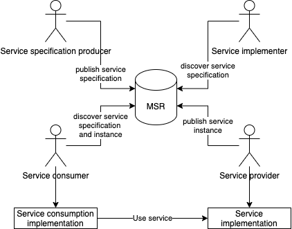

---
titlepage: true
toc-own-page: true
title: "Service specification for XYZ service"
author: [MCP Consortium]
date: "2021-04-21"
keywords: [Maritime technical service, MCP, Service registry]
logo: "materials/mcplogo.png"
titlepage-text-color: "476E7D"
footer-center: "G1128 Service Specification"
...

# Service specification for XYZ service
<!-- Hey it is comment! This must be seen only at the source code editing.  -->

## Introduction

A description should be given.

### Purpose
<!--
This template shall support the service architects in creating a description of the services (put down in writing) at a high level of abstraction, following the guidelines given in [1].  The template provides for each section descriptive instructions for the intended content.  Formally, such instructions are written in blue italic font – they shall be deleted when writing the actual service specification document.  In addition, some parts of this template provide suggested text fragments that may be directly re-used in the service specification document. Such proposed text fragments are given below.

The purpose of the service specification document is to write down the results of service identification and service design activities. The aim is to document the key aspects of a dedicated service at the logical level:
* the operational and business context of the service;
  * requirements for the service (e.g. information exchange requirements);
  * involved nodes: which operational components provide/consume the service;
  * operational activities supported by the service;
  * relation of the service to other services:
* the service description;
  * service interface definitions;
  * service interface operations;
  * service payload definition;
* service provision and validation aspects.

This service specification document describes just one dedicated service in detail at logical level. In addition, there shall exist a service portfolio document, which presents all services of the maritime cloud that are available (or are planned to become available) at a higher level.

The purpose of this service specification document is to provide a holistic overview of one service and its building blocks at logical level.  It may be complemented by a model based description (e.g. UML model describing the service interfaces, operations and data structures).  The service specification document describes a well-defined baseline of the service and clearly identifies the service version.  In this way, it supports the configuration management process.

The service specification document provides also the foundation material for the future standardisation process.

Note that the service specification is intended to be technology-agnostic.  The service specification document shall not describe the details of a specific service implementation. For that purpose, a service instance description shall be provided, where the realisation of the service with a dedicated technology shall be described.
This section shall be replaced by a suitable description of the purpose.  For instance:
-->

The purpose of this service specification document is to provide a holistic overview of the XYZ service and its building blocks in a technology-independent way, according to the guidelines given in [1].  It describes a well-defined baseline of the service by clearly identifying the service version.

The aim is to document the key aspects of the XYZ service at the logical level:

* the operational and business context of the service;
  * requirements for the service (e.g. information exchange requirements);
  * involved nodes: which operational components provide/consume the service;
  * operational activities supported by the service;
  * relation of the service to other services;
* the service description;
  * service interface definitions;
  * service interface operations;
  * service payload definition;
  * service dynamic behaviour description.
* service provision and validation aspects

*an example figure*

### Intended readership

<!--
This service specification template is intended to be read by service architects who shall produce service A description.
This section shall describe the intended readers. e.g.: -->

This service specification is intended to be read by service architects, system engineers and developers in charge of designing and developing an instance of the XYZ service.

Furthermore, this service specification is intended to be read by enterprise architects, service architects, information architects, system engineers and developers in pursuing architecting, design and development activities of other related services.

### Inputs from other sources
<!--
This section lists previous work on the subject covered by this document.
Special emphasis shall be put on what has been reused from other (already finished) projects. -->
This section provides an overview of activities, which are dealing with similar topics and lists already finished ones that provided inputs to this activity.

## Service identification

The purpose of this section is to provide a unique identification of the service and describe where the service is in terms of the engineering lifecycle.

<!-- Table below shall be completed. -->

Attribute | Content
--- | ---
Name | Service name
ID | Unique identity, e.g. in form of an MRN (Maritime Resource Name)
Version | Version of the XYZ service specification
Description | Description of the XYZ service
Keywords | Keywords that can be used to find the service in the service catalogue and taxonomy
Architect(s) | Name of service architects and their organisation
Status | Status of the service in the engineering lifecycle – either ‘Provisional’, ‘Released’, ‘Deprecated’ or ‘Deleted’. ‘Provisional’ - the service necessity has been identified, and a short description is available, but the full-service specification is not yet ready. ‘Released’ - the full-service specification is ready. ‘Deprecated’ - service specification is announced to become invalid in the near future. ‘Deleted’ - service specification is not valid any more.

## Operational context

This section describes the context of the service from an operational perspective.
<!--
The operational context description shall be based on the description of the operational model, consisting of a structure of operational nodes and operational activities.  If such an operational model exists, this section shall provide references to it.  If no such operational model exists, then its main aspects shall be described in this section.

Optionally, a simple high level use case, described in layman’s terms, could be provided as an introduction to this section.

The operational context shall be a description of how the service supports interaction among operational nodes. This can be achieved in two different levels of granularity:
1. A description of how the service supports the interaction between operational nodes. This basically consists of an overview about which operational nodes shall provide the service and which operational nodes will consume the service.
2. A more detailed description that indicates what operational activities the service supports in a process model.

Moreover, the operational context shall describe any requirement the service will fulfil or adhere to.  This refers to functional as well as non-functional requirements at high level (business/regulatory requirements, system requirements, user requirements).  Especially, information exchange requirements are of much interest since the major objective of services is to support interaction between operational nodes.
The source material for the operational context description should ideally be provided by operational users and is normally expressed in dedicated requirements documentation.  Ensure that the applicable documents are defined in the References section.  If no requirements documents are available, then the basic requirements for the service shall be defined in the section D 3.1.

Architectural elements applicable for this description are:
* Service;
* Nodes;
* Operational activities;
* Information exchange requirements.
-->

### Functional and non-functional requirements

<!--
This section lists all (functional and non-functional) requirements applicable to the service being described. A tabular list of requirements shall be added here.  If external requirements documents are available, then the tables shall refer to these requirements, otherwise the requirements shall be documented here.

The service must be linked to at least one requirement.  At least one of the following tables shall be presented in this section.  The first table lists references to requirements available from external documents.  Make sure you document the sources from where the requirements are coming from.  The second table lists new requirements defined for the first time in this service specification document.
-->

#### Functional requirements
Requirement Id | Requirement Name | Requirement Text | References
--- | --- | --- | ---
MSR-FR001 | something | something | something
MSR-FR002 | something | something | something
MSR-FR003 | something | something | something

##### Requirement definitions - XYZ-FR001
Requirement Id | Requirement Name
--- | ---
Requirement Name |
Requirement Text |
Rationale |
Author |

##### Requirement definitions - XYZ-FR002
Requirement Id | Requirement Name
--- | ---
Requirement Name |
Requirement Text |
Rationale |
Author |

##### Requirement definitions - XYZ-FR003
Requirement Id | Requirement Name
--- | ---
Requirement Name |
Requirement Text |
Rationale |
Author |

#### Non-functional requirements
Requirement Id | Requirement Name | Requirement Text | References
--- | --- | --- | ---
MSR-NFR001 | something | something | something
MSR-NFR002 | something | something | something
MSR-NFR003 | something | something | something

##### Requirement definitions - XYZ-NFR001
Requirement Id | Requirement Name
--- | ---
Requirement Name |
Requirement Text |
Rationale |
Author |

##### Requirement definitions - XYZ-NFR002
Requirement Id | Requirement XYZ
--- | ---
Requirement Name |
Requirement Text |
Rationale |
Author |

##### Requirement definitions - XYZ-NFR003
Requirement Id | Requirement Name
--- | ---
Requirement Name |
Requirement Text |
Rationale |
Author |

### Other constraints

#### Relevant industrial standards
<!--
List in this section the relevant industrial standards (if any) for the exchange of this type of data and or this type of service.  These may include, for example, OGC, WFS, WMS, etc.
-->
A description should be given.

#### Operational nodes
<!--
If an operational model exists in external documents, then this section just shows the Service to Nodes mapping by providing three tables, as described below.
If no external operational model exists, then the relevant operational nodes and their context shall be briefly described here before listing them in the tables of service providers and consumers.
-->
A description should be given.

##### Operational nodes providing XYZ service
Operational Node | Remarks
--- | ---
something | something

##### Operational nodes consuming XYZ service
Operational Node | Remarks
--- | ---
something | something

#### Operational activities (Optional)
<!--
Optional. If an operational model exists and provides sufficient details about operational activities, then this section shall include a mapping of the service to the relevant operational activities.
-->
A description should be given.

##### Operational activities supported by XYZ service
Operational Node | Remarks
--- | ---
something | something

## Service overview
<!--
This section aims at providing an overview of the main elements of the service.  The elements in this view are all usually created by an UML modelling tool.

Architectural elements applicable for this description are:
* Service - the element representing the service in its entirety;
* Service Interfaces - the mechanisms by which a service communicates. Defined by allocating service operations to either the provider or the consumer of the service;
* Service Operations - describe the logical operations used to access the service.
* Service Operations Parameter Definitions - identify data structures being exchanged via Service Operations.

The above elements may be depicted in one or more diagrams.  Which and how many diagrams are needed depends on the chosen architecture description framework and complexity of the service.
-->
A description should be given.

### Service interfaces

<!--
Describe the interfaces of the service including the selected Message Exchange Pattern (MEP) by using an UML diagram5 that illustrates the service interfaces definitions and operations and in tabular form.

It is also recommended to describe the considerations resulting in the selection of a certain message exchange pattern.

A service interface supports one or several service operations. Depending on the message exchange pattern, service operations are either to be implemented by the service provider (e.g. in a Request/Response MEP, query operations are provided by the service provider – the service consumer uses them in order to submit query requests to the service provider), or by the service consumer (e.g. in a Publish/Subscribe MEP, publication operations are provided by the service consumer – the service provider uses them to submit publications to the service consumer). This distinction shall be clearly visualised in a service interface table (see example below): for each service interface, it shall be stated whether it is either provided or used by the Service. A service provides at least one service interface.
An example diagram and corresponding table is given below.
-->
A description should be given.

## Service data model
This section describes the information model, i.e., the logical data structures to be exchanged between providers and consumers of the service.

<!--
It is recommended to visualise the data structures by using UML diagrams.  The full information model (logical data structure) shall be shown using diagram(s) and explanatory tables (see below).
-->

Example of an UML diagram:

<!--
It is mandatory to give a description of each entity item (class), its attributes and the associations between entity items after each diagram showing data items.

If the service data model is related to an external data model (e.g. being a subset of a standard data model, e.g. based on an S-100 specification), then the service data model shall refer to it: each data item of the service data model shall be mapped to a data item defined in the external data model.  This mapping may be added in the same table that describes the data items and their attributes and associations.  The idea is: when reading the service specification (including the logical service data model), the payload structures shall become clear to the reader.  If the service re-uses structures of an external data model, then these structures can be referred to rather than replicated in the service specification.  The tabular presentation of the payload allows for providing references to an externally defined model.

The table below is an example for describing a service data model including traces to an external model.
-->
### Service internal data model (Optional)
<!--
Optionally, this section may provide a description of the internal data model, as it seems appropriate to the service provider and/or the service consumer side.  Such description might be helpful for the better understanding as it provides additional information about the building of the service.  However, it should be considered just as an example – it is not an authoritative part of the service specification.
-->
A description should be given.

## Service interface specifications
This section describes the details of each service interface. One sub-section is provided for each Service Interface.
The Service Interface specification covers only the static design description while the dynamic design (behaviour) is described in section D 5.
<!--
The static interface description is vital since it describes how the interfaces shall be constructed.
Architectural elements applicable for this description are:
* Service Interfaces;
* Operations - function or procedures which enable programmatic communication with a Service via a Service interface;
* Parameters - constants or variables passed into or out of a Service interface as part of the execution of an Operation.
A Service may have one or more Service Interfaces.  Please describe each in separate sections below.
-->
### Service interface <INTERFACE NAME>
<!--
Please explain the purpose, message exchange pattern and architecture of the Interface.
A Service Interface supports one or several service operations.  Each operation in the service interface shall be described in the following sections.
-->
A description should be given.

#### Operation <OPERATION NAME>
<!--
Give an overview of the operation: Include here a textual description of the operation functionality. In most situations this will be the same as the operation description taken from the UML modelling tool.
-->
A description should be given.

##### Operation functionality
<!--
Describe the functionality of the operation, i.e. how does it produce the output from the input payload.
-->
A description should be given.

##### Operation parameters
<!--
Describe the logical data structure of input and output parameters of the operation (payload) by using an explanatory table (see below) and optionally UML diagrams (which are usually sub-sets of the service data model described in previous section above).
Figure 3 shows an example of a UML diagram (subset of the service data model, related to one operation).
-->

<!--
It is mandatory to provide a table with a clear description of each service operation parameter and the information about which data types defined in the service data mode are used by the service operation in its input and output parameters.
Note: While the descriptions provided in the service data model shall explain the data types in a neutral format, the descriptions provided here shall explicitly explain the purpose of the parameters for the operation.
-->
A description should be given.

## Service dynamic behaviour
<!--
This section describes the interactive behaviour between service interfaces (interaction specification) and, if required, between different services (orchestration).  Architectural elements applicable for this description are:
* Service Interaction Specifications;
* Service State machines;
* Service orchestration.
Following types of views and UML diagrams can be used to describe the dynamic behaviour:
* Sequence diagrams;
* Interaction diagrams;
* State machine diagrams.
-->
A description should be given.

### Service interface <INTERFACE NAME>
<!--
Include some information about the dynamic aspects of the service interface; each operation shall be exposed on at least one diagram.
An example sequence diagram is shown in Figure 4.
-->
A description should be given.

### Service orchestration (Optional)
<!--
This section shall be provided, if the composition of the service and/or the relation to other services (e.g., which other services are used to provide this service; which other services are intended to use this service) is deemed relevant for the service specification.
An example sequence diagram is given below. This very simple example indicates that the AddressForPersionLookupService (i.e., the service that is being described in this Service Specification Document) acts as a consumer of a “notifyAddressChange” operation of another service, called “AddressForPersionService”. Note that the other service needs to be described by its own Service Specification Document; a reference to that document shall be added here).
-->
A description should be given.

## Service provisioning (Optional)

<!--
This section shall describe the way services are planned to be provided and consumed.  It is labelled optional since one of the key aspects of service-orientation is to increase flexibility of the overall system by separating the definition of services from their implementation.  This means that a service can be provided in several different contexts that are not necessarily known at the time, when the service is designed.
-->
A description should be given.

## Definitions
The definitions of terms used in this IALA Guideline can be found in the International Dictionary of Marine Aids to Navigation (IALA Dictionary) at http://www.iala-aism.org/wiki/dictionary and were checked as correct at the time of going to print.  Where conflict arises, the IALA Dictionary shall be considered as the authoritative source of definitions used in IALA documents.

### Terminology
Persons producing the Technical Service are invited to add definitions to the following list as appropriate.

Term | Definition
--- | ---
MSR | Maritime Service Registry
MIR | Maritime Identity Registry
MRN | Maritime Resource Name

### Terminology
Persons producing the Technical Service are invited to provide a list of acronyms as appropriate.

Acronym | Meaning
--- | ---
MSR | Maritime Service Registry
MIR | Maritime Identity Registry
MRN | Maritime Resource Name

## References
<!--
This section shall include all references used when designing the service.  Specifically, the applicable steering and requirements documents shall be listed.
-->
1. IALA Guideline - G1128 THE SPECIFICATION OF e-NAVIGATION TECHNICAL SERVICES
2. http://mrnregistry.org/
3. S-100 Universal Hydrographic Data Model, http://www.iho.int/iho_pubs/standard/S-100/S-100_Ed_2/S_100_V2.0.0_June-2015.pdf
